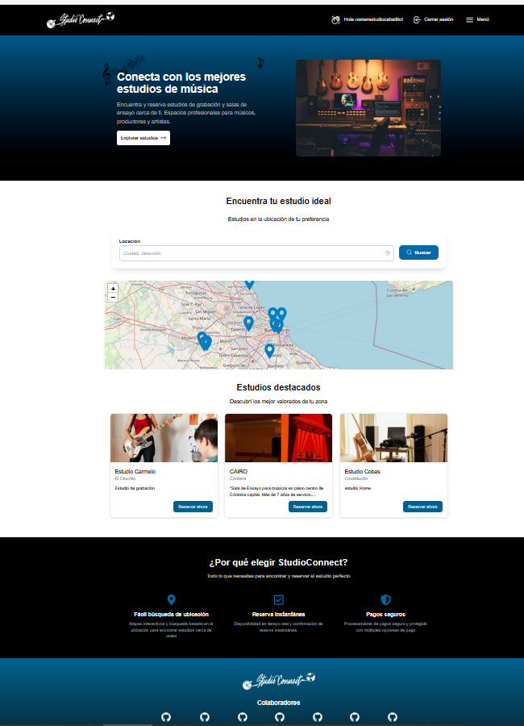
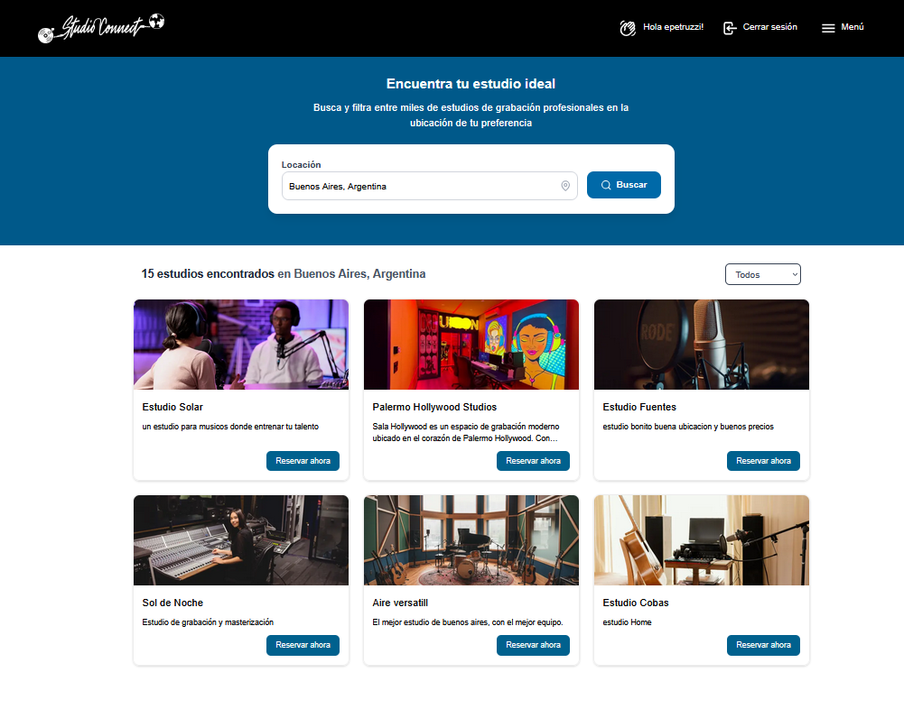
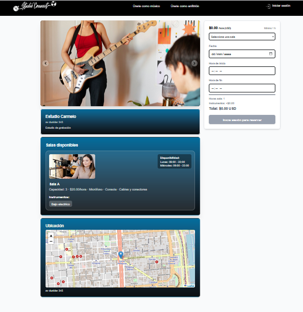
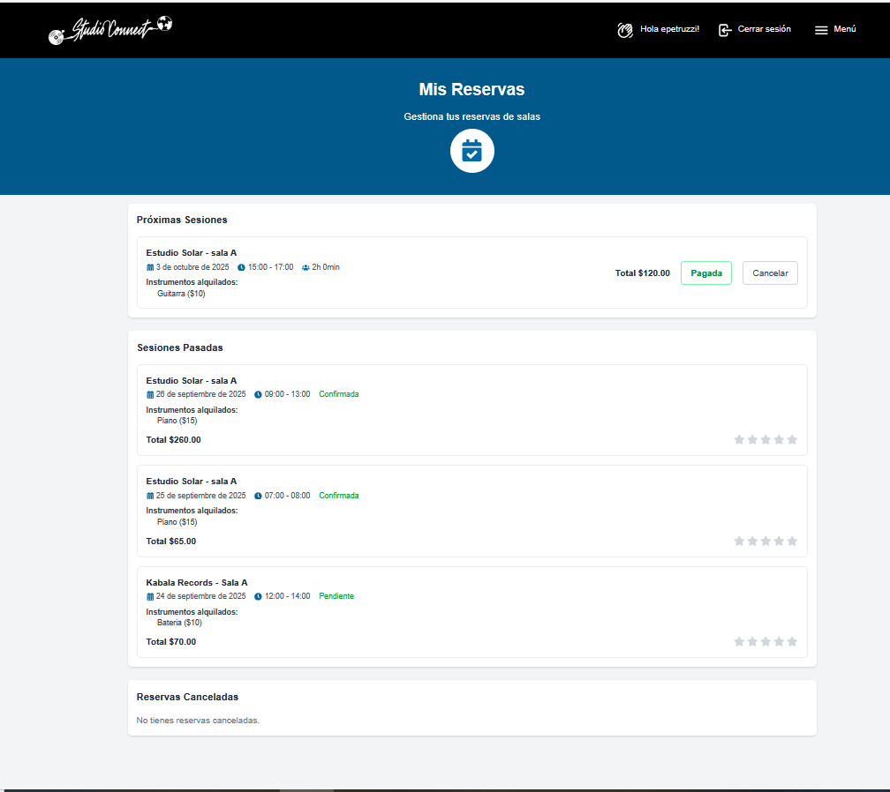

# 👋 ¡Hola! Soy **Ezequiel Petruzzi**  

💻 **Fullstack Developer | Project Manager | +6 años de experiencia**  
🚀 Apasionado por crear software escalable, modular y con impacto positivo.  
🌍 Desarrollo proyectos reales como **ClinCare** (gestión médica) y **StudioConnect** (reservas de estudios musicales).  

---

## 🚀 Tecnologías y Herramientas  

### ⚡ Stack Principal  
           
         

---

### 🛠️ Stack Complementario  
                            

---

## 📂 Proyectos Destacados  

### 🔹 ClinCare – Gestión médica  
- Turnos médicos + historial clínico.  
- Control de agendas para evitar solapamientos.  
- Roles y seguridad con JWT.  

### 🔹 Proyecto Final Henry 

### 🔹 StudioConnect – Reservas de estudios musicales  
- Administración de usuarios y estudios.  
- Calendario dinámico de reservas.  
- Pagos integrados con Stripe.  
👉 [Repositorio](https://github.com/studioconnect2025/studioconnect_front) | [Demo](https://studioconnect-front.vercel.app/)

## 🖼️ Vistas de la app

<!-- Galería compacta -->
| Home | Búsqueda | Detalle de estudio | Mis reservas |
|---|---|---|---|
|  |  |  |  |

---

## 🌱 Sobre mí  

- 🌍 Vivo en Argentina.  
- 🏃 Entreno triatlón → disciplina, constancia y foco que aplico también al código.  
- 🐕 Tango, mi Border Collie, me acompaña en cada proyecto.  
- 🌱 Apasionado por la tecnología, la vida al aire libre y el desarrollo de software con impacto positivo.  

---

## 🤝 Aptitudes de Liderazgo  

- Más de **5 años de experiencia en coordinación de equipos** de desarrollo.  
- **Toma de decisiones técnicas** en proyectos complejos, priorizando escalabilidad y sostenibilidad.  
- Experiencia en **infraestructura de servidores y cloud** (**AWS**, Railway, Heroku, Vercel).  
- Capacidad para **integrar lo técnico y lo estratégico**, alineando al equipo con los objetivos del negocio.  
- Liderazgo en proyectos como **Project Manager** en StudioConnect.  

---

## 📫 Conectemos  

  

💬 **¿Buscas alguien para tu equipo?**  
Escribime a [epetruzzi@gmail.com](mailto:ezequiel@tudominio.com) y charlemos sobre cómo puedo aportar valor a tu proyecto.  

---

👉 *“Siempre abierto a aprender, colaborar y crear software que cambie el mundo para bien.”*  
